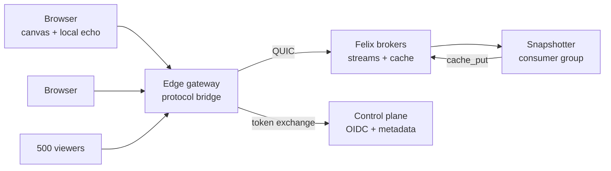
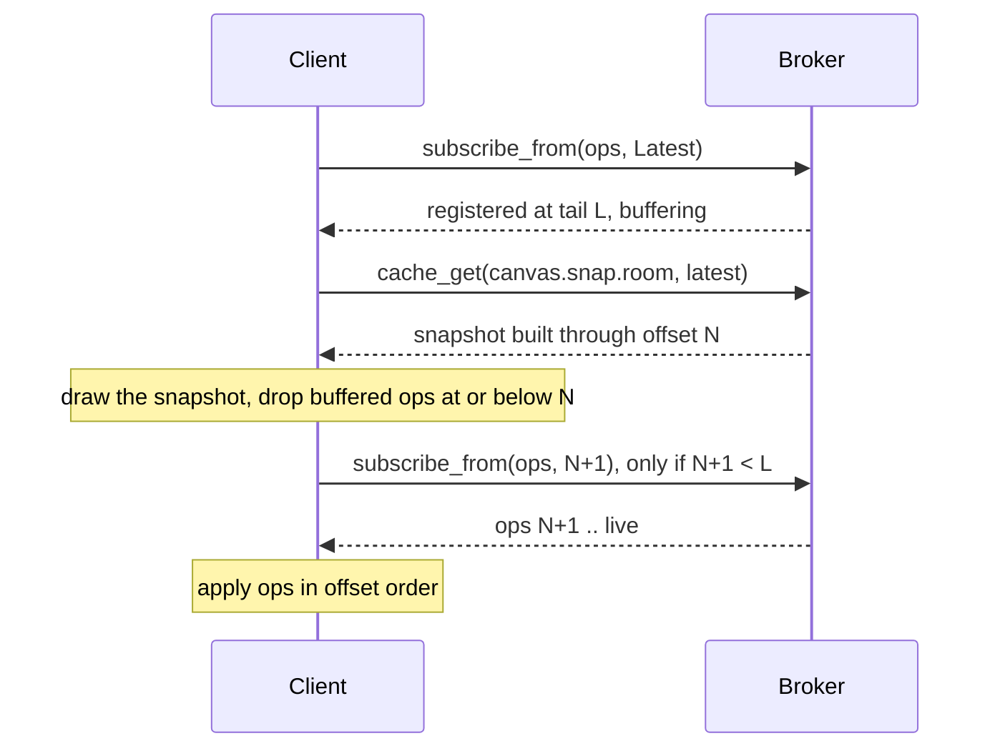
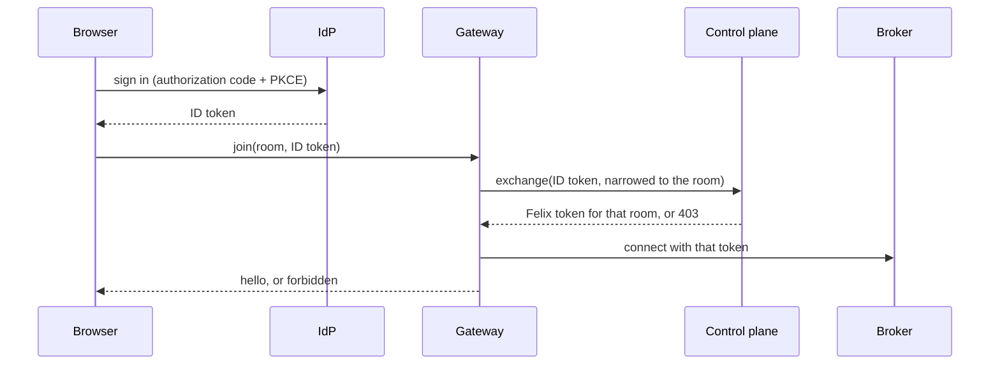
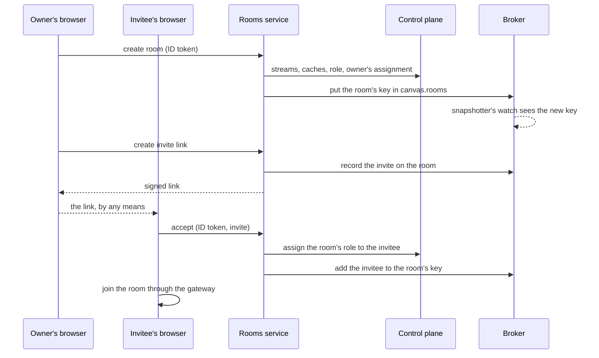
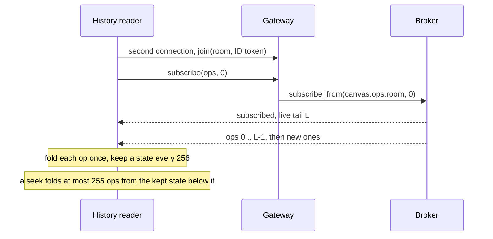

# Felix Canvas design

A multiplayer drawing canvas whose entire backend is [Felix](https://github.com/GetFelix/felix):
shapes, cursors, presence, history and snapshots in Felix streams and caches,
reached over one authenticated QUIC connection.

It exists to argue something a broker alone cannot: that cheap fanout,
per-subscriber isolation and replay-by-offset are product features, not
benchmark rows. The audience is an engineer who would otherwise wire Redis
beside Kafka and does not yet believe one system covers both.

How it looks and feels is in the UX and visual design brief, [ux.md](ux.md).

**In scope**

- Freeform shapes on an infinite canvas: rectangle, ellipse, line, pen stroke, text, image placeholder
- Rich text in text shapes and inside rectangles and ellipses, with two people able to type in one block at once (see Text editing)
- Live cursors, selections and presence for everyone in a room
- Durable document history with replay and a time scrubber
- Multi-tenant rooms behind the user's own IdP
- A deliberate slow-client lane, because the isolation property is only convincing when you can watch it work

**Out of scope**

- Text formatting beyond the first set in Text editing: no tables, code blocks, images or comments inside text, and no fonts other than Inter
- Offline-first editing with weeks of divergence; the design assumes a client reconnects within the retention window
- Permissions finer than room-level (see Authorization for why, and what it would cost)
- Anything that needs a second datastore. If a feature cannot be expressed in streams, caches and counters, it is out by definition

## Success criteria

The project succeeds if five demonstrations work in front of a skeptic.

| # | Demonstration | Passes when |
|---|---|---|
| 1 | Flat fanout | 500 connected viewers on one room; the drawing client's publish-to-ack p50 stays within 15% of the same measurement with 1 viewer |
| 2 | Slow client isolation | One viewer throttled to 100 kbit/s; the other 499 show no added latency, and the throttled one reports its own loss rather than stalling anyone |
| 3 | Correct rejoin | The throttled viewer reconnects and its canvas converges to byte-identical shape state, verified by comparing a content hash against another client |
| 4 | Replay | Scrub a 10,000-op document backwards and forwards; every intermediate frame is reproducible from the log alone, with no server-side session state |
| 5 | Survive broker loss | Kill the broker owning the room's stream mid-stroke; editing resumes on the new owner with no lost acknowledged op and no duplicate op |

Two criteria are deliberately absent. Raw message rate is not a goal: a canvas
will never push millions of messages a second, and claiming it as a product
number would be dishonest. Nor is scale in rooms: one broker holding one busy
room is the interesting case, since a stream shard has a single owner.

## How these are normally built

Nothing in this design is a new idea about collaborative editing. The merge rule
below is the one Figma already uses. What is unusual is the layer underneath it,
so it is worth being precise about what that layer normally is.

Three shapes dominate, and they differ mostly in where the merge happens:

| Shape | Merge runs | Examples | The server is |
|---|---|---|---|
| Authoritative document process | On the server, over a total order it defines | Google Docs (OT), Figma (LWW per property) | A stateful process owning one document in memory |
| CRDT plus a relay | In every client, independently | Yjs with `y-websocket`, Automerge, PartyKit | A relay that also persists, still usually one room per process |
| Managed realtime service | Wherever the vendor put it | Firebase, Supabase Realtime, Liveblocks, Ably | Someone else's problem, at someone else's price |

Self-hosted, the first two assemble from roughly the same parts:

- **A WebSocket tier** terminating browsers, with **sticky routing** so every client in a room reaches the process holding it.
- **Redis pub/sub or NATS** to fan a room's updates across that tier when they do not.
- **Postgres or object storage** for the document of record and its snapshots.
- **Kafka**, eventually, when history or audit turns out to be a requirement after all.
- **A separate presence path**, usually Redis keys with a TTL, kept away from the durable one because cursors at 60 Hz would swamp it.

That stack works. Most of the collaborative software you have used is built from
it. Its seams are in known places:

**The order of truth is split across systems.** Redis has one order, Postgres
another, Kafka a third, and none of them is defined relative to the others. On
reconnect, which one should the client believe? The common answer is none of
them: refetch the whole document.

**A drop is invisible.** Redis pub/sub is at-most-once and carries no offsets.
When a relay's per-client buffer fills it drops, and the client has no way to
learn that it did. A canvas that missed one op renders a wrong picture and never
finds out. This is the failure the usual stack handles worst, and it is why
reloading the page is collaborative software's universal repair.

**Live and historical are different code paths.** The live path is a socket, the
history path is a table or a topic. Replay, time travel and "catch me up from
where I was" get written twice, against two sources that can disagree.

**The relay is stateful, which makes it a liability.** A document lives in one
process's memory, so the application inherits sticky sessions, rehydration on
every deploy, and a placement problem of its own to solve.

**Fanout is billed per connection.** A relay that serializes once per client pays
500× for 500 viewers, which is why viewer-heavy rooms are where these systems
first get expensive.

### What changes when the substrate is a log

This design keeps the merge rule and replaces what sits under it: one durable
stream per room, one ephemeral stream for cursors, one cache key for snapshots.
The seams above stop being application work and become properties of the broker.

| Seam | Usual stack | Here |
|---|---|---|
| Order of truth | Split across Redis, Postgres, Kafka | One shard, one offset sequence, no second opinion |
| Drop detection | Silent | A gap in offsets, which is an error the client recovers from |
| Catch-up vs. history | Two paths, two sources | `subscribe_from(offset)`, the same call for both |
| Slow client | A buffer policy hand-written in the relay | A bounded per-subscriber queue with a declared overflow policy |
| Fanout cost | Encode per connection | Encoded once, shared by every subscriber |
| Relay state | Owns the room | Owns a socket; no sticky routing, nothing to rehydrate |
| Failover | Application-level document placement | Shard ownership under a lease, already the broker's job |

The claim is not that a log is a novel way to hold a document; event sourcing
predates all of this. It is that *the same log* is doing the live fanout, so the
two things that normally live in separate systems, and disagree, share one
structure and one order.

**What it costs.** The trade is real and runs in both directions:

- **A browser cannot speak QUIC to Felix**, so this design pays for a gateway hop that anyone using `y-websocket` does not.
- **Felix is not a database.** No object ACLs, no queries, no transactions, so room membership has to live in Felix RBAC rather than in a list of its own (see Authorization).
- **One room is one shard is one owning broker**, the same single-owner constraint as a per-document server process. The difference is that failover is machinery Felix already has rather than something this application invents.
- **Delivery is at-least-once**, so clients must dedupe; a CRDT stack gets idempotence from the merge function for free. Text is the one place this design uses a CRDT too, inside ops on the log.
- **Offline editing for weeks is out.** CRDTs win that outright, and this design does not compete for it.
- **Replay is bounded by retention.** A history that must reach back further than the log needs checkpoints the log alone does not provide (see How far back the scrubber reaches).

## Architecture

Exactly one new process type sits between a browser and Felix: an edge gateway
that terminates the browser's connection and speaks Felix's QUIC protocol on the
other side. Everything else is Felix or a browser.

The gateway holds no canvas state. It owns a browser socket, an attenuated Felix
token and a Felix connection, and it copies frames between them; a room's truth
lives only in the broker's log and cache. That constraint is what keeps
demonstration 4 honest: if the gateway cached shapes, replay would be proving
the gateway works, not the log.

| Component | Language | Holds state? | Responsibility |
|---|---|---|---|
| Canvas client | TypeScript + Canvas2D/WebGL | Yes, a local replica | Render, generate ops, optimistic echo, reconcile on ack |
| Edge gateway | Rust, `felix-client` | No | Browser transport, token exchange and attenuation, frame relay |
| Brokers | Felix | Yes, authoritative | Op log per room, snapshot cache, presence, group cursors |
| Control plane | Felix | Yes, metadata | Token exchange against the IdP, tenant/stream registration |
| Snapshotter | TypeScript on Node, `felix-client` from npm | No | Reads the op log as a consumer group, writes compacted snapshots |
| Rooms service | TypeScript on Node, in the snapshotter's package and image | No, its records are in Felix | Optional. Lets signed-in people create rooms and invite others; see [Self-service rooms](#self-service-rooms) |

The canvas client and the snapshotter share the op schema, its encoding and
the fold through the `model/` package, so the state a browser renders and the
state a snapshot stores come from the same code.

The gateway is Rust because it never needs that code. It relays bytes, so the
language boundary keeps it from growing canvas logic, and it can move into Felix
later as a first-party browser bridge built on `felix-client`. It also fans out
to many sessions without a JavaScript round trip per event.

The gateway does not know any canvas names either. A scope file,
`deploy/scope.toml`, says what a connection opens (a room) and which streams,
caches and counters each room owns, under short aliases the browser uses.
[protocol.md](protocol.md#the-scope-file) lists it. Everything that makes
those resources a canvas lives in the browser and the snapshotter, so the same
gateway can serve another application on Felix with a different scope file.
It now has its own repository, [felix-gateway](https://github.com/GetFelix/felix-gateway), and
the canvas runs its 0.3.1 release.

The snapshotter is a separate process on purpose. Snapshot writes are throughput
work and must never share a fate with an interactive socket, and running it as a
consumer group gives it redelivery and dead-lettering for free.

## Data model

Everything is scoped `(tenant, namespace, name)`, which maps cleanly onto the
product: tenant is the customer, namespace is the workspace, and the last
segment names a room.

| What | Felix primitive | Name | Durability |
|---|---|---|---|
| Edit operations | Durable stream | `canvas.ops.<room>` | Log-backed, kept until broker-wide retention trims it |
| Cursors and presence | Ephemeral stream | `canvas.presence.<room>` | None, at-most-once by design |
| Compacted snapshot | Cache key | `canvas.snap.<room>` / `latest` | Log-backed, survives restart |
| Snapshot's log position | Same cache value | stored inside the snapshot record | Written atomically with the snapshot |
| Who is in the room now | Cache keys with TTL | `canvas.members.<room>` / `<session>` | TTL 30 s from the gateway scope file's `ttl_s`, refreshed by heartbeat |
| Op sequence per session | Counter | `canvas.seq.<room>` / `<session>` | Log-backed |
| Who may open the room | Felix RBAC role | `role:room-<room>` | Control plane store |
| Snapshot worker cursor | Consumer group | group `snapshotter` | Replicated with the shard |

Through the gateway, the browser calls the room's resources by their aliases
in the scope file: `ops`, `presence`, `snap`, `members` and `seq`.

**Edits and presence are separate streams.** They have opposite requirements: an
edit must never be dropped, a cursor position from 40 ms ago is worthless.
Splitting them lets the edit stream run with durability and the presence stream
run in memory with `DropNew`, so a backed-up cursor feed cannot consume queue
space an edit needs.

**One room is one shard, deliberately.** Felix shards a stream across owners and
orders records within a shard, not across them. A canvas wants one total order
per room, so a room maps to a single shard and therefore a single owning broker.
Rooms spread across the cluster by name; one room does not.

Text adds no primitive. A text body's changes are ops on `canvas.ops.<room>`
like any other edit, and its state travels in the snapshot with the shapes
(see Text editing).

The snapshot value is a single record holding both the serialized shape set and
the log offset it was built from. Keeping them in one value is the whole trick
behind the join path: a reader cannot observe a snapshot without also learning
exactly where in the log it stops.

## Editing model

The log is the document. A room's state is a pure fold over its op stream, so
any two clients that have applied the same prefix hold the same canvas.

**What Felix gives you, exactly.** Records in one shard get offsets in the order
the broker admits them, and delivered events carry those offsets. Ordering is
guaranteed per publisher path, and the log offset is the authority when two
publishers race. Delivery is at-least-once on a durable stream, and Felix is
explicit that it offers no exactly-once, so the client must tolerate a repeat.

**What the client owes:**

1. Apply ops in offset order, never in arrival order. Buffer anything that arrives ahead of the next expected offset.
2. Deduplicate on `(session_id, seq)` carried in the op body, because a retried publish can land twice. A session's ops reach the log in `seq` order, since the gateway publishes a connection's ops one at a time and seqs come from a counter that only grows, so the fold keeps only each session's highest applied `seq` and ignores anything at or below it.
3. Make every op commutative or offset-ordered, since two clients can have ops admitted between each other's.

**Conflict resolution: last-writer-wins per shape field, keyed on log offset.**
Each op names a shape id and a sparse set of fields. Concurrent edits to
different fields of one shape both survive; concurrent edits to the same field
resolve to the higher offset. No vector clocks.

That choice is defensible because shapes are a map, not a sequence, and maps
under LWW converge trivially. The places it shows its limits are z-order, which
uses fractional indexing between neighbours, freehand strokes, which are
immutable once finished and so never conflict at all, and text.

Text is a sequence, and LWW would throw away one of two people typing in the
same paragraph. So a text body is a Yjs document, and its changes are `text`
ops whose payload is a Yjs update. The log still orders them and the fold still
applies them in offset order; Yjs only decides how concurrent inserts and
formatting merge. Text editing below has the details.

Op shape, MessagePack-encoded, roughly 60–120 bytes for a typical move:

| Field | Type | Purpose |
|---|---|---|
| `sid` | u64 | Session that authored the op, for dedupe and echo suppression |
| `seq` | u32 | Per-session counter, monotonic, for dedupe |
| `shape` | u128 | Target shape id, client-generated |
| `kind` | enum | `create` / `patch` / `delete` / `text` |
| `fields` | map | Only the changed fields; for `text`, the Yjs update |
| `t` | u64, optional | When the author made the edit, for the history timeline only |

Echo suppression matters more than it looks. A client applies its own op
optimistically, then sees it again from the broker. The client keeps its
unacknowledged ops as a pending list drawn on top of the fold of the log, so a
field with a local write shows that write whatever arrives for it meanwhile,
which is Figma's rule. When its own op comes back, matched on `(sid, seq)`, the
op leaves the pending list and enters the fold at its offset, which is how the
replica learns its own position in the log. The value on screen does not change,
because every write that reached the log before it had a lower offset.

The gateway refuses a session's writes past 50 a second rather than queueing
them, and a drag changes a shape on every frame. So the client publishes at
most 20 ops a second, with bursts of 40, and presence at most 25. An edit that
waits for the budget stays unsent, and later patches to the same shape fold
into it, so a long drag sends its latest position about 20 times a second
whatever the screen's frame rate.

## Text editing

Text shapes, rectangles and ellipses can hold a body of rich text. Two people
can type in the same paragraph at once and both edits survive. The body is
still part of the room's fold, so snapshots, the join path, gap recovery and
the scrubber cover it with no second path.

### What the first version formats

| Kind | Options | Stored as |
|---|---|---|
| Inline style | Bold, italic, underline | Yjs marks `b`, `i`, `u` |
| Link | An `http`, `https` or `mailto` address | Mark `a` with the address |
| Font size | Small, Medium, Large, Huge: 12, 16, 20 and 28 canvas units | Mark `size` with the step name; Medium when absent |
| Colour | Ink, Muted, and the eight colours of the presence palette; never the cyan accent | Mark `color` with the colour's name; Ink when absent |
| Block | Paragraph, heading 1 to 3, bulleted list, numbered list, nested to three levels | Element names `p`, `h`, `ul`, `ol`, `li` |

Colours are stored by name, not value, so dark mode can shift their lightness
as the UX brief asks, and so a body can never carry a colour outside the
palette. The schema lives in `model/` as plain constants. The editor builds its
ProseMirror schema from them, and the fold uses them to decide what counts as
content.

### The editor

The editor is ProseMirror with `y-prosemirror`.

| Option | For | Against |
|---|---|---|
| ProseMirror + `y-prosemirror` | Plain TypeScript and DOM, no framework. The schema is ours, so it holds exactly the formats above. `y-prosemirror` is the Yjs author's own binding and the most used one | More assembly: keymaps, toolbar commands and the caret plugin are ours to write |
| Tiptap | Ready-made extensions for every format above | A layer over ProseMirror that this design does not need. Its collaboration and caret extensions assume a Yjs provider and awareness, which this design replaces with the log and the presence stream |
| Lexical | Fast, MIT, good IME handling | Its Yjs binding and examples centre on React and on a provider that owns the document. Using it without either means working against the library |
| Plain `contenteditable` | No dependency | Selection, IME, paste and undo across browsers, plus a Yjs binding of our own. That is the research project the old scope ruled out |

CONTRIBUTING.md rules out a UI framework in `web/`, which settles most of it.
ProseMirror is framework-free, and the schema being ours is what keeps the
formatting set small and the derived content in the fold well defined.

### Editing on a canvas

The canvas draws every body itself. A body is in the DOM only while someone in
this tab is editing it.

- Double-click a text shape, rectangle or ellipse, press Enter with one selected, or click or drag with the text tool, and the editor opens over the shape: a ProseMirror view in an absolutely positioned element, scaled with the camera by a CSS transform, using the same font, size and line height as the canvas.
- While the editor is open the renderer skips that body, so it is never drawn twice. Panning and zooming move the editor with the canvas.
- Esc, a click outside the shape or choosing another tool closes it, and the canvas draws the body again.
- A tab edits one body at a time.

A text shape's width is a field like any other, and a width of 0 makes the box
grow with its longest line, as a box made with a click does; dragging with the
text tool, or a handle, sets a width. Its height follows its content: every
replica computes it from the same layout, so it is not stored.
In a rectangle or ellipse the text wraps to the box less a padding of 8 canvas
units, is centred vertically, and runs past the box when it does not fit.

### Rich text on the canvas

Viewers who are not editing see a body drawn by `web/src/textlayout.ts`, a
small layout engine for this schema:

1. Walk the body's derived content into blocks and runs, each run with one font, size, colour and decoration.
2. Break lines greedily at the word boundaries `Intl.Segmenter` gives, measuring with `measureText` in the run's font. Only the boundaries CSS also breaks at count: after a space, after a hyphen between letters, and around an ideograph. Trailing spaces hang past the edge, as `pre-wrap` makes them. A word wider than the line breaks by character.
3. Draw runs with `fillText`, underlines and link underlines as thin rectangles, list markers in the gutter.

Layout happens in canvas units at the body's own size, and the camera transform
scales it, so zooming does not lay out again. Layouts are cached per body,
keyed by its content and width; typing lays out one body. Measuring waits for
Inter to load, and a font load clears the cache.

The editor and the canvas must wrap the same way, or text jumps when the
editor opens. The editor's CSS matches the layout's rules (Inter, the same line
heights, `white-space: pre-wrap`, `overflow-wrap: anywhere`, kerning on in
both, and none of the font features the rest of the interface turns on), and
an end-to-end test compares the two line by line, and their heights, on a
fixed set of bodies. A line with several sizes on it takes its height from
each font's ascent and descent, rounded as Blink rounds them, so mixed sizes
stack the same way in both. List markers are `::marker` content in the editor
and the same strings, with their trailing space, on the canvas. Mixed-direction text is laid out run by run, without full
bidirectional reordering. That is a known limit of the first version.

Two other ways were rejected. Drawing the DOM into the canvas through an SVG
`foreignObject` is asynchronous, slow for every frame, needs fonts embedded,
and behaves differently across browsers. Keeping a DOM element over every body
makes thousands of transformed elements on a busy board, and they cannot
interleave with canvas shapes in z-order.

### One Yjs document per body

Each body is its own `Y.Doc` with one root `Y.XmlFragment` named `body`.

- **Root types never conflict.** In one document per room, bodies would be nested types under a map, and two people creating the same body at once would each make one; the map keeps one and the other's text is lost. A root type with a fixed name merges.
- **Deleting a shape deletes its text.** A room document keeps every root type it ever had. A per-body document leaves the next snapshot with the shape.
- **An op already names its shape**, so the fold touches one small document per op, and history copies only the bodies that changed.

A body comes into being with the first `text` op on a shape that exists. There
is no separate create.

### Text ops in the log

A text op is an ordinary op with kind `text` (wire value 3) and one field, `y`:
a Yjs update in Yjs's version 2 encoding, which is the smaller one for typing.
Typing a few characters makes an op of about 100 bytes, 16 of them the shape id.

- **Dedupe is unchanged.** The fold checks `(sid, seq)` before it looks at the kind, so a retried text op is dropped like any other. Yjs updates are also idempotent, so a repeat that got past the check would change nothing.
- **Ignored like a patch.** A text op on a shape that does not exist, on a line or a stroke, or whose update does not decode, changes nothing. A delete stays final. The fold decodes an update in full before applying it, because Yjs can throw halfway through applying a malformed one, and a fold working in place would keep the half.
- **Bounded.** An op whose update is over 64 KB is ignored. The fold and the editor apply the same rule, so every replica agrees on what a body holds. The editor refuses a paste that would take a body past 10,000 characters, so an honest client never comes near the bound.
- **Client ids.** A Yjs client id is a 32-bit hash of the session id, so a body's state vector gains one entry per session that edits it, not one per editing turn.

The log order is what makes this safe. An author's update depends only on text
it had seen, which reached it through the log at lower offsets, and on its own
earlier ops, which reach the log first because a session's ops land in `seq`
order. Applied in offset order, an update's dependencies are always there
already. A body left with Yjs pending structures after an op means a record was
skipped, or that the log never held what an author's update depends on, which
only a broken or hostile client can cause. A browser's offset-gap detection
already rules out the first, and the second leaves every replica holding the
same waiting update, so browsers do nothing about it. The snapshotter, which
can skip a record (see Snapshots), checks.

### The fold

`Doc` gains `texts`, a map from shape id to an immutable `TextBody`: the
body's Yjs state, encoded, and its derived content, worked out on first use.

- `apply` makes a new body from the old state plus the update. That costs time in proportion to the body, which is fine at the rate one person's ops arrive.
- `applyInPlace` keeps one live `Y.Doc` per body it has touched and applies updates to it directly. Freezing, at a kept history state or an answer, hands each changed document to a new `TextBody`, which encodes it only when something asks for its state; the next change to that body takes the document back after encoding it. This is the same split as for shapes, for the same reason.
- The live replica's confirmed state only moves forward, so it folds in place and freezes when it is read, at most once a frame, rather than decoding a body per delivered op.
- A delete removes the shape's body with it.

Derived content is what the renderer draws and the hash covers: blocks, each
with its type and attributes and a list of runs of text with their marks.
`model/` works it out by walking the fragment with the schema constants, with
no ProseMirror and no DOM, so the snapshotter on Node gets the same answer as a
browser. Anything outside the schema, such as an unknown element, an unknown
mark, a colour not in the palette or a link to another scheme, is left out. A
client that writes such things gets nothing on anyone's screen and nothing in
the hash.

### Pending text and echo

While the editor is open it works on its own `Y.Doc`: the confirmed body, plus
this session's text ops the log has not delivered back yet, plus every text op
delivered for that body while it is open. Yjs merges are commutative and
idempotent, so this session's own echo changes nothing and other people's text
arrives under the caret without moving it.

The replica's view merges this session's pending text ops for a body into one
update and applies it on top of the confirmed body, so after the editor closes
the canvas still shows text the log has not confirmed. The confirmed state, and
the version in the Sync panel, cover only the log. Text needs no echo rule like
Figma's: an insert never overwrites anything, so there is no field to protect.

Undo inside the editor uses `y-prosemirror`'s undo plugin, which tracks only
this session's changes. Undoing writes new updates to the log, the same rule as
undo everywhere else in the design: your own changes only, appended, never
rewritten.

### Coalescing keystrokes

The editor's document produces an update per keystroke. Those collect in a
buffer and go out as one op, merged with `Y.mergeUpdatesV2`:

- 150 ms after the first unsent change, so steady typing sends at most about 7 ops a second per person;
- at once when the editor closes, so leaving a shape never leaves text unsent;
- at once when the buffer passes 8 KB, which in practice is a paste.

While disconnected, a new text op merges into the newest unsent one for the
same body, as unsent drags already do, so an hour offline sends one op per
body touched, not thousands.

The cost on the log is small. A drag publishes on every pointer move; typing
publishes 7 ops a second at most. An hour of one person typing steadily is about
15,000 ops and 1.5 MB of log. The snapshot grows much less: a body's Yjs state
is roughly its text plus its formatting, since deleted text is
garbage-collected out of the fold's documents and runs typed by one person are
stored as one item. A page of text is a few kilobytes.

Another person sees typing within the flush window plus the usual edit path,
which sets the text target below at 250 ms rather than the 50 ms for shapes.

### Text in the state hash

Two replicas can hold the same text in different Yjs bytes, because the
encoding depends on history and client ids. So the hash never covers Yjs
bytes. `stateHash` adds a `body` entry to each shape that has text: its
derived content with adjacent runs of identical marks merged, encoded with the
same sorted-key MessagePack as the shape fields. Same content means the same
hash, which is the comparison demonstration 3 needs: same picture, not same
history.

### Snapshots

The snapshot format goes to version 2 and adds `texts`: one `[id, state]` pair
per body, where `state` is `Y.encodeStateAsUpdateV2` of its document. The
decoder still reads version 1, which has no text. The snapshotter folds in
place and encodes bodies only when it writes.

Before writing, the snapshotter checks that no body it changed has pending
Yjs structures. If one does, a record was probably skipped (see the
snapshotter startup wait below), so it writes nothing, logs it, and starts
again from the stored snapshot once the records it had not acknowledged come
back, a visibility timeout later. If the same body waits for the same thing
again after that, the log itself lacks it, and the snapshotter writes the
snapshot with the waiting update in it, as every browser holds it. Without
that second rule one bad update would stop a room's snapshots for good.

A joining browser decodes each body once, which costs time in proportion to the
text in the room. A snapshot must stay under the broker's 16 MiB frame limit;
the per-body bound leaves room for hundreds of full bodies, and the snapshotter
logs a warning when a snapshot passes 4 MiB.

### Replay and the scrubber

History works as it does for shapes. Kept states every 256 changes hold frozen
bodies, and freezing re-encodes only the bodies that changed since the last
kept state. A seek starts from a kept state; the bodies touched by the at most
255 ops it folds are decoded once from their kept state, updated and derived
again, and every other body shares the kept content. A seek therefore costs in
proportion to the bodies it touches, not to the room.

The targets for history stay as they are, with text in the mix: on a
10,000-change room where half the changes are text ops spread over 50 bodies,
loading stays under 0.5 ms per change and the slowest seek under 50 ms.

Yjs has its own snapshots for viewing a document's past, and they were
rejected. They need garbage collection off in every replica, which keeps every
deleted character forever, and they cover only text, so the scrubber would
still need the fold for shapes.

### Carets of others

A presence message gains an optional `txt`: the shape id, and the anchor and
head of the selection as encoded Yjs relative positions, about 10 bytes each.
A relative position points at a character rather than an index, so it stays put
while other people type before it. It is sent while the editor is open, with
the same once-a-frame pacing as the cursor, and left out otherwise.

A viewer resolves the positions against its own copy of the body. When it
cannot, because the text the caret points into has not reached it yet, it keeps
the last position until it can. Inside an open editor, a small plugin of our
own resolves them when the carets or the body change from outside, and moves
them through this editor's own typing in between, since while ProseMirror
applies a keystroke the Yjs document has not caught up yet. The editor draws
them in a layer over its text, placed with `coordsAtPos`, rather than as
decorations: changing ProseMirror's DOM puts back a selection it has not read
yet, so a Home key pressed as someone else's caret moved would be lost.
`y-prosemirror`'s caret plugin expects a `y-protocols` awareness object, which
the presence stream replaces. On the canvas, the renderer draws them from the
body's layout.

### Gap recovery, access and the snapshotter wait

**Gap recovery.** Text ops are records like any other, so a drop is still a gap
in offsets and recovery reads the missed records in order, which keeps every
update's dependencies in place. A rejoin from the snapshot replaces the
confirmed state. An open editor merges the snapshot's body into its own
document, which is idempotent, so the caret and the unsent text stay. Pending
text ops the snapshot already holds are confirmed by the usual `seq` rule.
Tail loss is still caught by peers' applied counts.

**Per-room access.** Text needs no new resource: its ops are on the op stream
and its carets on the presence stream, both already in the narrowed token. A
room member can still write anything into a body, so content is treated as
data. The editor builds DOM only through the schema, pasted HTML is parsed
against the schema and everything else dropped, links are limited to `http`,
`https` and `mailto`, and they open with `noopener`.

**The snapshotter startup wait.** Until
[felix#962](https://github.com/GetFelix/felix/issues/962) is fixed, the
snapshotter waits 30 seconds on startup so its predecessor's claims come back
before newer records. Text raises the stakes of getting that wrong. A record
the snapshotter skips loses one LWW write for shapes, but for text it strands
every later update that author made to that body. The wait stays, and the
pending-structure check above turns a skip into a retry rather than a wrong
snapshot. During the wait, joins read more of the log, which at typing rates
is a few hundred ops.

### Dependencies

Every new dependency is MIT licensed.

| Package | Used by | License |
|---|---|---|
| `yjs` 13.6, with its dependency `lib0` | `model/`, `web/`, `snapshotter/` | MIT |
| `y-prosemirror` 1.x | `web/` | MIT |
| `y-protocols` | `web/`, only because `y-prosemirror` names it as a peer dependency | MIT |
| `prosemirror-model`, `-state`, `-view`, `-transform`, `-commands`, `-keymap`, `-schema-list`, `-inputrules`, with `orderedmap` and `w3c-keyname` | `web/` | MIT |

`model/` takes only `yjs`, so the snapshotter carries no editor code. Yjs 14
(published as `@y/y`) and `y-prosemirror` 2 are in pre-release as of October
2026. This design pins the stable lines and moves once those are released,
after checking that their update encoding reads what the log already holds.

## Join and snapshot

The rule is **subscribe before you read**. Registering the live subscription
first means any op published during the snapshot fetch is already queued for this
client; reading the snapshot first would lose exactly those ops. This is not
hypothetical: it is the same ordering defect Felix's own broker was written to
avoid, and it reappears in every application built on top.

The live subscription is opened with `StartPosition::Latest` rather than with no
position, because only then does the broker report the tail `L` it registered
at. The client applies the snapshot, keeps buffered ops above `N`, and when the
snapshot stops short of `L` reads the ops in between with a second subscription
from `N + 1`. When the snapshotter is caught up, `N + 1 = L` and the second read
never happens. A room with no snapshot yet is the case `N = -1`: the client reads
the whole log.

The client draws the snapshot as soon as it decodes and applies the remaining
ops on top, so a cold join shows a correct, slightly old frame first rather than
an empty canvas. In the cold-join test a browser joining a 10,000-op room while
another session edits draws that frame in well under the 500 ms target and ends
with the same state hash as a browser that saw every op live.

**Snapshot production.** The snapshotter reads `canvas.ops.<room>` through a
consumer group, folds ops into its replica, and every 500 ops or 30 seconds
writes the serialized state plus the last applied offset to the cache. It acks
only after the `cache_put` returns, so a crash redelivers the window rather than
losing it. Rewriting the same key is idempotent, which makes at-least-once
redelivery harmless here.

The value is one MessagePack record: the shapes with the offset that last wrote
each field, each text body's Yjs state, the highest applied `seq` per session,
and the offset `N` it was built through. The seqs travel with the shapes so that a retried op landing
after the snapshot is still recognised as a repeat. The snapshotter starts from
the stored snapshot, folds records in offset order and skips any at or below
the last one it folded, which is what a redelivery always is.

A record handed to a snapshotter that then died stays claimed until the
broker's visibility timeout lapses, and the group hands newer records out in
the meantime. A starting snapshotter therefore waits out that timeout before
it reads, so the old claims come back first and the fold stays in offset order.

Each room has exactly one group member: one snapshotter process reads every
room in the deployment, a reader per room. A group splits records between its
members, and a member that saw only some of a room's ops would write a wrong
snapshot, so a second process would have to stand by rather than poll. Each record is held for
at most one snapshot interval before it is acknowledged, which stays inside the
broker's 30-second visibility timeout and its five-attempt dead-letter bound.

**Why not ask a peer for state.** Peer-to-peer state transfer would make
correctness depend on which client answered, and that client's own replica might
be behind. The snapshot's authority comes from being derived from the log at a
named offset, by a process that has no other job.

## Presence and cursors

At 60 Hz with 50 active editors, cursors are 3,000 msg/s into one room, fanned to
every viewer, and a cursor position two frames old is not worth the queue slot
it occupies. So the presence stream is ephemeral, runs with
`SubQueuePolicy::DropNew`, and publishes fire-and-forget with `AckMode::None`.

- **Coalesce at the client.** Sample pointer moves at render rate and publish at most one position per frame.
- **Never let presence share a queue with edits.** Separate streams mean separate per-subscriber queues.
- **Membership lives in the cache, not the stream.** One retained watch on the room's own members cache, instead of inferring who is present from a window of cursor traffic. Each room has its own cache, so watching the whole of it is the member list. The watch starts with every current entry and then delivers each change, so the list stays live without polling.

Membership uses TTL as a liveness mechanism: each session writes
key `<session>` of `canvas.members.<room>` and refreshes it every 10 seconds.
The gateway puts each write with the `members` cache's `ttl_s` from its scope
file, 30 seconds; the cache itself is created without a TTL. A client that
vanishes without a goodbye stops refreshing and expires, which matters, because
a browser closing a laptop lid sends no goodbye.

The cost is that a crashed session lingers in the member list for up to 30
seconds. That is the right trade for a presence indicator and the wrong trade for
a lock, which is one reason this design has no locks. A tab that closes normally
deletes its entry on the way out, so only crashes and closed lids wait for the
TTL.

Felix expires a cache entry lazily: it is absent from the next read, but nothing
is written when it lapses, so a watch never hears about it
([felix#960](https://github.com/GetFelix/felix/issues/960)). Each change on the
watch carries its expiry, the gateway relays it as milliseconds remaining, and
every browser drops an entry whose time has passed. The TTL stored with each
entry still decides who appears in a fresh list.

The cursor feed and the member list answer different questions. The member list
says who is in the room; cursor traffic says who is doing something. A member
whose cursor has not moved for 10 seconds, or whose tab is in the background and
sends nothing, shows as away rather than gone.

## Browser transport

Felix is QUIC end to end, and a browser reaches it through a gateway. The
options below differ in which browser protocol that gateway speaks.

| Option | Work | Browser support | Cursor path | Auth surface |
|---|---|---|---|---|
| WebSocket gateway | Days | Universal | Reliable, ordered; coalescing carries it | Token stays server-side |
| WebTransport gateway | Weeks | Chrome, Edge, Firefox; not Safari | Unreliable datagrams, ideal fit | Token stays server-side |
| WebTransport in the broker | Months, in Felix itself | Same gap | Ideal | Browser holds a Felix token |

**Start with the WebSocket gateway, behind a transport trait.** It unblocks the
product in days, works in every browser, and the coalescing that cursors need
anyway removes most of what unreliable datagrams would buy. The gateway adds one
hop: budget 1–2 ms in-region, against a 16 ms frame budget.

**The third row is a trap.** Putting WebTransport in the broker sounds like the
pure answer and is the wrong one: it would hand a Felix token to untrusted
JavaScript, force origin and certificate policy into the broker's transport
layer, and make the browser's connection lifecycle a Felix concern. The gateway
is not an apology for missing WebTransport. It is the auth boundary, and it
would exist anyway.

One thing the gateway must not become is a router. The moment it starts merging
or reordering ops for clients, the claim that the log is the document stops being
true.

## Authorization

Per-room authorization works without any change to Felix, because the control
plane's token exchange can narrow permissions and Felix's permission strings are
matched over resources like `stream:tenant/namespace/canvas.ops.room-42`.

1. The browser signs in against the deployment's IdP and joins a room on the gateway with its ID token.
2. The gateway exchanges the ID token at the control plane, **narrowing** the request to that room's resources with the actions the scope file allows on each: publish and subscribe on the op and presence streams, write on the sequence counters, read on the snapshot cache, and read and write on the member list.
3. The gateway refuses the join unless the token it got back holds every one of those grants (a resource the scope file marks `optional` may be missing), then opens a Felix connection with it, one per session, and relays.
4. The token refreshes before it expires. A refresh re-runs RBAC with the same narrowing, so a person removed from a room loses access within one token lifetime.

The exchange can only narrow what RBAC already grants, never widen it, so a
bug in the gateway cannot produce a token with more reach than the signed-in
person genuinely has. And the narrowed token is what the broker checks: a
session in one room cannot publish to, subscribe to or read another room even
when the same person may open both. felix-gateway's integration tests prove that
against the broker directly, with no gateway code in the path.

**Every room has its own caches.** Felix authorizes a cache as a whole, never
one key of it, so one shared snapshot cache keyed by room could not be
narrowed to a room. Each room gets `canvas.seq.<room>`, `canvas.snap.<room>`
and `canvas.members.<room>` beside its two streams.

**Room membership is Felix RBAC.** Each room has a role, `role:room-<room>`,
whose policies grant exactly the room's resources, and a member is anyone
assigned that role: a person directly (by Felix principal, the SHA-256 of
`issuer|subject`), or an IdP group (`group:<issuer>#<group>`), which lets a
deployment manage rooms in its own directory. The two options weighed before
were both worse. Cache keys would be a database built in a cache, with
last-writer-wins membership edits. A small external store would be a second
datastore. RBAC is already transactional, already consulted at every exchange
and refresh, and needs no new process. The cost is that creating a room means
creating its streams, caches and role, which the seed does for the rooms an
operator lists and the rooms service does for rooms people create.

The gateway's own check is therefore short: a valid room name, and a token
that covers the room. It holds no membership list and could not widen one.

Per-shape or per-layer permissions do not work here. That is finer than the
broker's unit of authorization, so it would have to be enforced in the gateway,
and gateway-enforced rules are exactly the kind of claim this project should not
make.

## Self-service rooms

An operator lists rooms and their members in `CANVAS_ROOMS`, and the seed
creates them. A public deployment needs people to make their own, which the
optional rooms service provides. It is a small HTTP service under `/api/` on
the page's origin, and it holds the one thing the browser must never have: a
Felix admin credential. It signs in as the seed's `canvas-admin` account
through the internal provider, as the seed does, and renews its tokens before
they expire.

It runs from the snapshotter's package and image rather than as a fourth
image. That package already has `felix-client` and the Node build, the image
already carries the seed and the internal provider, and the service shares
the room list's format with the snapshotter.

**Who is calling.** Every request carries the browser's ID token, the same one
the gateway exchanges. The service checks it as the control plane does: an
ES256 or RS256 signature by one of the provider's published keys, the issuer,
the audience and the lifetime. It names the caller by the same subject claim
and the same Felix principal, the SHA-256 of `issuer|subject`, so the person
it puts in a role is exactly the person the token exchange later finds there.

**The room list.** Each room people created is one key in the Felix cache
`canvas.rooms`: its title, its owner's principal, its members with the names
their sign-ins gave, and its open invites. The seed creates the cache with one
shard. Felix still decides who may open a room, through the room's role; the
list adds what RBAC cannot hold, which is who owns a room, what people are
called and which invite links are open. The service is the list's only
writer, so it runs as one replica and keeps the list in memory, reading it
once at start with a watch that delivers every key's value. It makes one
change at a time, so a limit check and the write it guards never interleave.

**Creating a room.** The service checks the creator's limit, then does for
one room what the seed does for each room it lists: the two streams, the three
caches, the role and its policies, and the creator's assignment to the role.
Only then does it write the room's key. A room id is `r` and eleven random
letters and digits, never a name a person chose, so nobody can claim another
team's room name and every id is a valid gateway scope and Felix name. The
title is only for people.

**Invite links.** An invite is a token in the page address,
`/?invite=<token>`: the room, the invite's id and its expiry, with an
HMAC-SHA256 over them under `CANVAS_INVITE_SECRET`. The signature stops anyone
from making up a link, and the room's key holds every open invite by id, so
revoking one is deleting its id and expiry is checked against the stored time,
not only the signed one. Anyone holding a link may join until it expires or is
revoked, as with a shared link in other whiteboards; a room has at most
`CANVAS_INVITES_PER_ROOM` open at once and `CANVAS_MEMBERS_PER_ROOM` people. The
owner can copy an open link again at any time, because the same claims under
the same key sign to the same token.

**Owners.** Only the owner creates or revokes invites, removes people and
deletes the room. Anyone else in the room may leave it. Someone outside a room
gets "not found" for it, so a room id reveals nothing. Removing someone takes
away their role assignment; deleting a room removes its key first, so it stops
being listed and folded at once, then every assignment, the role's policies,
the streams and the caches.

**Taking access away.** A removed person cannot join again: the token
exchange at their next join finds no role. A session they already have keeps
working until its Felix token refreshes, because Felix cannot revoke a token
it issued. Browser sessions' tokens last `FELIX_TOKEN_TTL_SECONDS`, which is
long today because the broker's own credential shares that setting
([felix#955](https://github.com/GetFelix/felix/issues/955)).

**The snapshotter** folds the rooms in `CANVAS_ROOMS` and every room in
`canvas.rooms`. It watches the cache with the same retained watch, starts
folding a room when its key appears and stops when the key is deleted, so a
new room is snapshotted without a restart.

Operator rooms keep working as before. They are not in `canvas.rooms`, so they
have no owner and do not show in anyone's rooms list, and the seed still
manages their members.

## History and the time scrubber

History mode turns the tool bar into a timeline over every change in the room,
and the canvas shows the room as it was at the playhead. Dragging back and
forth, stepping one change at a time or playing it forwards all ask the same
question: what does a fold of the log up to this change look like?

**Nothing is kept on the server.** The browser reads the history over a second
gateway connection, narrowed to the room exactly as the first one is, by
subscribing to the op log from offset 0. The gateway relays it like any other
subscription and the broker reads it from the log. Leaving history mode closes
that connection, and coming back subscribes again from the last offset the
browser already holds. The live session never pauses: it keeps its own
subscription, so returning to live shows everything that happened meanwhile,
and its gap detection never sees the history read.

**Every position is a fold of the log.** `History` in `model/` folds each op
once as it arrives and keeps the room's state every 256 changes. A seek starts
from the nearest kept state at or below the target, or from the last answer when
that is closer, and folds forward with the same `apply` the live replica uses.
A unit test checks every position of a 3,000-op log, scrubbed forwards,
backwards and in jumps, against a fresh fold to that position, and the
end-to-end test does the same on a 10,000-change room in a real browser, half
of whose changes type into 50 text boxes. The slowest seek there takes about
12 ms, most of it decoding the bodies the seek touches, and loading the history
takes about 1.7 seconds per 10,000 changes on a 4-core machine.

Folding in place matters here. The live fold copies a shape map per op so that
every state it hands out stays valid; over a whole history that copying cost
3.6 seconds for 10,000 ops on 300 shapes. History folds into one working
state and copies only at kept states and answers. Text bodies follow the same
rule: live Yjs documents while folding, re-encoded only when a kept state or an
answer is copied out (see Replay and the scrubber).

**Times come from the ops.** Felix stores a write time with every record but
does not deliver it, so each op carries `t`, the time its author made it by the
author's own clock. The timeline is laid out by change number, so a wrong
clock can mislabel a change but never reorder one. Ops written before this
field show no time.

### How far back the scrubber reaches

The scrubber reaches as far back as the room's log does, and no further. There
are no checkpoint snapshots.

That is decided against what Felix does today, not what this design once
assumed. Felix keeps a durable log forever unless the broker sets
`FELIX_DURABLE_RETENTION_BYTES` or `FELIX_DURABLE_RETENTION_SECONDS`, and those
apply to every stream on the broker. A retention policy set on one stream in the
control plane is stored and ignored
([felix#964](https://github.com/GetFelix/felix/issues/964)), so the 30-day window
the data model once named is not something a deployment can actually set per
room. With the defaults, history reaches every room's first change.

When a broker-wide limit has trimmed the start of the log, the subscription
from 0 is refused as `trimmed`. History then starts from the room's snapshot,
the oldest state the log can still rebuild, and reads on from the offset after
it. The timeline marks the missing part with a hatched stub labelled "History
starts at change N".

Checkpoints were the alternative: the snapshotter keeping a snapshot every
so many changes under its own key. They are not worth it yet. They would be a
second copy of history kept in a cache, growing without bound, with its own
retention to decide. Whoever sets a broker-wide limit has already chosen to
keep less history. Checkpoints become worth it when per-stream retention
works and a deployment wants short op retention with long history.

## Failure modes

| Failure | What Felix does | What the client does | What the user sees |
|---|---|---|---|
| Slow viewer | Fills that subscriber's bounded queue, drops per policy, others untouched | Detects an offset gap, re-joins from its last applied offset | A brief "catching up" state, then correct canvas |
| Viewer offline briefly | Retains the log; the subscription ends | Reconnect, `subscribe_from(last_offset + 1)` | Nothing, if under a few seconds |
| Offline past retention | Answers a read below the trim point with `CursorTooOld` and the oldest surviving offset | Discards its replica, keeps its unsent edits, re-joins from the snapshot | The canvas dims under "Rebuilding" while the recent changes load |
| Owning broker lost | Reassigns the shard; a caught-up replica is promoted | Reconnect; unacked ops retry | A stall of roughly the failover window |
| Publish unacked at failover | May have committed or not | Retries with the same `(sid, seq)`; dedupe absorbs the double | Nothing |
| Snapshotter dies | Redelivers what it had not acknowledged once it restarts | Unaffected; joins replay further from the log | Slightly slower joins |
| Cache watch falls behind | Ends the watch with `Lagged { resume_from }` | Re-watch from the named offset | Nothing |
| Snapshotter skips a text op | Nothing; the skip is the snapshotter's | Finds a body with pending Yjs structures, writes nothing, restarts from the stored snapshot | Slightly slower joins |
| Old client meets a text op | Delivers it like any record | Cannot decode it, counts the offset as applied, and its text and version drift from everyone else's | Missing text in that tab until it reloads the new version |

**Every recovery path is the join path.** A client that has fallen behind, been
disconnected, been trimmed, or been failed over does the same thing: re-subscribe
from an offset, or if that offset is gone, take a snapshot and continue. One code
path, exercised constantly, rather than four rarely-run ones.

The drop case deserves the loudest handling. Because durable deliveries carry log
offsets, a gap in received offsets is exactly a drop, and the client should treat
it as an error to recover from, never as something to paper over. A canvas that
silently keeps a hole in its op sequence renders a wrong picture and never finds
out.

With `DropNew`, a slow viewer loses **new** ops rather than queued old ones,
which is why recovery must be offset-driven rather than "wait for it to drain".

It also means the last ops of a burst can be the ones dropped, and then no
later op arrives to reveal the gap. Felix gives the subscriber no signal for
that, so peers fill in: each presence message carries how many changes its
sender has applied, and a viewer that is still short of a peer's count two
seconds later treats it as a drop. Presence is sent at least every 3 seconds,
so a silent tail loss is found within a few seconds.

### Losing the owning broker

This needs three brokers and `CANVAS_REPLICAS=3` (the Helm chart's
`felix.replicas: 3`, or `dev/up.sh --cluster`). The default compose install
runs one broker with one replica, so losing it stops the room until it comes
back. With three, each room's op log, presence stream and caches are replicated
to three brokers, and the op log and caches use `Quorum` consistency, so an
acknowledgement means two of the three hold the change. When the broker that owns the room stops,
the control plane promotes a replica that holds every acknowledged record.

Nothing in the canvas knows which broker that is. The gateway gives each
session's Felix client every broker's address, starting each session at a
different one, and the client follows the room to its new owner:

- A publish that was in flight fails or times out. The browser cannot tell
  whether it landed, so it closes its gateway connection, reconnects, and sends
  every unacknowledged edit again in `seq` order. One that had landed lands a
  second time and the fold's `(sid, seq)` dedupe drops it.
- The op subscription follows the log to its new owner from the next offset.
  When it cannot, it ends, and the browser subscribes again from its last
  applied offset plus one, exactly as after a gap.
- Cursors are at most once, so the browser asks for the live presence stream
  again and carries on.
- The status chip shows "Reconnecting" while the edits wait.
- The snapshotter connects again from the next broker address and waits out
  the group's visibility timeout before it reads, as it does at startup, so
  records a lost poll answer left claimed come back first.

The end-to-end test `web/e2e/failover.e2e.ts` runs this against the
three-broker stack in `dev/`: two browsers nudge shapes every 25 ms while a
third watches the room's history, and the broker that owns the room's op log
is killed. Both editors end with the same state hash, which is also the fold
of the log read back from offset 0; every edit either browser saw acknowledged
is in that log; the history view reaches the same state; the snapshotter keeps
folding; and a browser that joins afterwards matches. The control plane in the
dev stack expires a silent broker after 3 seconds, and the longest wait
between acknowledged edits in the test is that window plus the time to notice
the dead connection: about 6 seconds on a 4-core Codespace. Felix's defaults, a 15 second expiry and a 6 second idle
timeout, would stretch it to about 20 seconds.

### The slow-client lane

The Sync panel has a switch that throttles its own tab to 100 kbit/s. The
gateway then reads that connection's Felix subscriptions no faster than such a
link would carry the events. It drops nothing itself: Felix's bounded queue for
that subscriber fills and drops new events, exactly as for a viewer on a bad
network. The throttle sits in the gateway rather than in the network because it
has to work per browser tab and in CI, where shaping one WebSocket with `tc` is
neither.

The throttled tab shows "Your connection is slow" with a count of the changes
it is catching up on, reads them from the log, and ends with "Back in sync" and
its canvas version, which matches the version in any other window's Sync panel.
The end-to-end test `web/e2e/isolation.e2e.ts` runs this with three browsers
under 300 changes a second: the throttled one reports its loss and reaches the
same state hash, and the other browsers' save time stays within the 50 ms
target and within 1.5 times plus 10 ms of its median without the throttled
viewer. On a 4-core Codespace the median moves from about 21 ms to about 26 ms.
That is the cost of the throttled tab reading its missed changes back from the
log, which is real work for the broker; nobody waits on the slow tab itself.

## Performance targets

Set by human perception, not by Felix's ceilings.

| Path | Target | Measured how |
|---|---|---|
| Local echo (input to own pixel) | < 16 ms, one frame | Client-side frame timing, no network |
| Edit visible to another client, same region | < 50 ms p50, < 150 ms p99 | Timestamped op round trip, clocks on one host |
| Typed text visible to another client | < 250 ms p50, < 400 ms p99 | Keystroke to the character on another screen, including the 150 ms flush window |
| Keystroke to own character in the editor | < 16 ms, one frame | Client-side frame timing |
| Text ops per typing person | ≤ 7 per second | Op count over a scripted typing run |
| Cursor visible to another client | < 40 ms p50 | Same, on the presence stream |
| Join a 10,000-op room | < 500 ms to first correct frame | Snapshot fetch + tail replay, cold client; also with half the ops text across 50 bodies |
| Load a 10,000-change history, half of it text | < 0.5 ms per change | End-to-end history test |
| Seek in that history | < 50 ms, slowest seek | Same test, 24 stops back and forth |
| Lay out one 2,000-character body | < 4 ms | Unit benchmark in the browser |
| Fanout degradation, 1 → 500 viewers | Publish p50 within 15% | Felix subscriptions for the viewers, as `felix-loadgen` makes them |
| Snapshot lag | < 1,000 ops behind the tail | Group cursor offset versus stream tail |

Manufacture the 500 viewers as Felix subscriptions, the way `felix-loadgen`
does: 500 browser tabs are not a measurable population. Real browsers carry the
human-facing paths. `felix-loadgen` itself does not fit, because its pubsub
scenario always publishes its own records at full speed, so
felix-gateway's `examples/viewers.rs` holds the subscriptions instead while one real
browser edits. [performance.md](performance.md) records each measurement and
the machine it came from; [development.md](development.md#measuring-the-performance-targets)
describes how each is timed.

**Budget the hop, then check it.** Of the 50 ms edit-visible target, Felix's own
share is under a millisecond in-region. The rest is browser input latency, the
gateway hop each way, and rendering. Instrument the gateway's two legs separately
from the start, so the instinct to blame the broker can be settled with data.

One knob is worth knowing in advance: broker delivery batching dominates
publish-to-subscriber latency, and the same cluster measured 5,907 µs p50 under
default batching versus 190 µs under the latency profile.

## Build order

| M | Milestone | Proves | Rough size |
|---|---|---|---|
| 0 | WebSocket gateway relaying publish and subscribe for one hardcoded room | A browser can reach Felix at all | 3–5 days |
| 1 | Two browsers, shapes and drag, ops on a durable stream, offset-ordered apply | The log is the document | 1–2 weeks |
| 2 | Snapshotter + join path with subscribe-before-read | A cold client joins a busy room correctly | 1 week |
| 3 | Presence stream, cursors, TTL membership | The ephemeral/durable split is real | 1 week |
| 4 | Deliberate slow-client lane + offset-gap recovery | Demonstrations 2 and 3 | 1 week |
| 5 | Time scrubber over the op log | Demonstration 4 | 1 week |
| 6 | Token exchange with per-room narrowing, real IdP | Multi-tenancy enforced by the broker | 1 week |
| 7 | 500-viewer stress with `felix-loadgen`, kill the owning broker | Demonstrations 1 and 5 | 1 week |
| 8 | Release images, a compose install, a configurable IdP, a Helm chart | Anyone can self-host it, following [self-hosting.md](self-hosting.md) | 1 week |
| 9 | Rich text in shapes: Yjs updates as ops in the log, an overlay editor, canvas text layout, carets of others | A CRDT rides the same log: concurrent typing merges, and snapshots, rejoin and the scrubber still work as a fold | 3–4 weeks |

**M0 is the one to start first**, and it is worth building even if the canvas is
never finished: a WebSocket bridge to Felix is the missing piece for every
browser-facing demo.

Two existing pieces shorten this. Felix's `demos/slow-consumer` already drives
the overflow behavior M4 needs, and `demos/state-divergence` already has the
shape of the hash-comparison check demonstration 3 wants.

The honest total is 8–10 weeks of evenings for a single person through M8, and
the first genuinely impressive demo lands at M4. Rich text, M9, is the largest
single piece of frontend work in the plan and comes last for that reason.

## Risks, and what this surfaces in Felix

The real risk is not technical. A canvas is a large piece of frontend work, and
the frontend has nothing to do with Felix: weeks can disappear into
pointer-event handling and produce no argument about the broker. The mitigation
is the milestone order: everything that proves something about Felix lands by M4.

- Frontend scope creep, as above. A cap: no feature that does not appear in one of the five demonstrations.
- Rich text is mostly frontend work. Editor wiring, a canvas layout engine and caret drawing prove little about Felix beyond "a CRDT rides the log". The cap is the formatting list in Text editing; anything past it waits.
- The canvas and the editor wrap text differently and text jumps when the editor opens. The line-by-line comparison test is the guard.
- Yjs is between major versions. Pinning the stable line is safe; the move to Yjs 14 needs a check that old ops still decode.
- A text-heavy room grows its snapshot. The per-body bound and the 4 MiB warning keep it far under the broker's frame limit, but a room with thousands of full bodies would need the snapshot split, which this design does not do.
- The gateway quietly becoming stateful. Treat state in the gateway as a design defect, not an optimization.
- Retention versus replay. Whatever the broker keeps bounds how far the scrubber can go.

**What this project would contribute upstream to Felix:**

1. **A first-party browser bridge.** The gateway built here generalizes, and is now [felix-gateway](https://github.com/GetFelix/felix-gateway): WebSocket or WebTransport ingress belongs in Felix itself, and is the largest single unlock for browser-facing products.
2. **Key-level cache authorization.** Narrowing stops at a whole cache, so every room needs its own caches. Grants over a key prefix would let rooms share them.
3. **A TypeScript client.** Felix has Rust and Python clients and a Node addon; a browser-side one would let the gateway shrink to pure transport.
4. **Snapshot-plus-offset as a primitive.** Every application that wants fast joins needs this pattern; a helper in `felix-client` would hand it to all of them.

**Open questions**

- [x] Does room membership live in cache keys, or in a small external store? Neither: in Felix RBAC, one role per room (see Authorization).
- [x] Is the scrubber bounded by retention, or does it also need periodic checkpoint snapshots to reach further back? Bounded by retention, which Felix leaves off by default (see How far back the scrubber reaches).
- [x] What conflict model does text need, since LWW would drop one of two people typing? A CRDT, Yjs, whose updates are ops on the log (see Text editing).
- [ ] One gateway process per region, or one per room owner to keep the QUIC path shortest?
